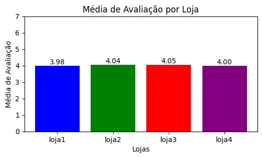
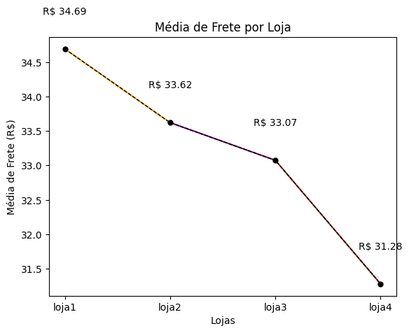

# AluraStoreBr - Análise de Dados de Vendas📊 

Este Jupyter Notebook📓 (`AluraStoreBr.ipynb`) contém a análise de dados de vendas de uma loja online, com o objetivo de fornecer insights sobre o faturamento e desempenho dos produtos.

## 1. Propósito da Análise Realizada🎯

A análise tem como objetivo principal:

* **Calcular o faturamento total** de cada loja (Loja 1, Loja 2, Loja 3 e Loja 4) a partir dos dados de vendas.
* **Identificar os produtos mais e menos vendidos** em termos de quantidade em cada loja.
* **Visualizar o faturamento** das lojas para facilitar a comparação do desempenho.

Essas análises ajudam a entender quais lojas estão performando melhor em termos de receita, quais produtos são mais populares e quais podem precisar de mais atenção em termos de estratégia de vendas.

## 2. Estrutura do Projeto e Organização dos Arquivos📂

O projeto consiste em um único arquivo:

* `AluraStoreBr.ipynb`: Este é o Jupyter Notebook📓 que contém todo o código Python para a análise dos dados.

O notebook lê os dados de vendas de quatro diferentes arquivos CSV, cada um representando os dados de uma loja. Os URLs dos arquivos CSV são:

* `https://raw.githubusercontent.com/alura-es-cursos/challenge1-data-science/refs/heads/main/base-de-dados-challenge-1/loja_1.csv`
* `https://raw.githubusercontent.com/alura-es-cursos/challenge1-data-science/refs/heads/main/base-de-dados-challenge-1/loja_2.csv`
* `https://raw.githubusercontent.com/alura-es-cursos/challenge1-data-science/refs/heads/main/base-de-dados-challenge-1/loja_3.csv`
* `https://raw.githubusercontent.com/alura-es-cursos/challenge1-data-science/refs/heads/main/base-de-dados-challenge-1/loja_4.csv`

O notebook organiza os dados em DataFrames do Pandas (`loja1`, `loja2`, `loja3`, `loja4`) e utiliza dicionários para armazenar os resultados das análises (por exemplo, `faturamentos` para o faturamento total de cada loja).

## 3. Exemplos de Gráficos e Insights Obtidos🖼️

O notebook gera um gráfico de barras para visualizar o faturamento total de cada loja.

**Exemplo de Gráfico:**

**Insights Obtidos:**

* O gráfico permite comparar visualmente o desempenho de faturamento entre as lojas.
* É possível identificar qual loja teve o maior e o menor faturamento no período analisado.
* Os valores exatos do faturamento são exibidos acima de cada barra para uma análise mais precisa.

Além do faturamento, o notebook também fornece insights sobre os produtos mais e menos vendidos em cada loja, o que pode ajudar a otimizar o estoque e as estratégias de marketing.

## 4. Instruções para Executar o Notebook🚀

Para executar o notebook e reproduzir a análise, siga as instruções abaixo:

1.  **Pré-requisitos:**
    * Python 3.x instalado.
    * Bibliotecas Python:
        * `pandas`
        * `matplotlib`
    * Jupyter Notebook ou JupyterLab instalado (ou utilizar um ambiente online como o Google Colab).

2.  **Execução:**
    * Baixe o arquivo `AluraStoreBr.ipynb`.
    * Abra o notebook em Jupyter Notebook, JupyterLab ou Google Colab.
    * Execute todas as células do notebook sequencialmente. O notebook irá:
        * Carregar os dados de vendas dos arquivos CSV.
        * Calcular o faturamento total de cada loja.
        * Gerar o gráfico de faturamento.
        * Imprimir os resultados no console.

## 5. Tecnologias Utilizadas💻💻💻        

* Python
 

* google colab  
 
* Pandas

   
* Matplotlib        
    
* Seaborn   

    

